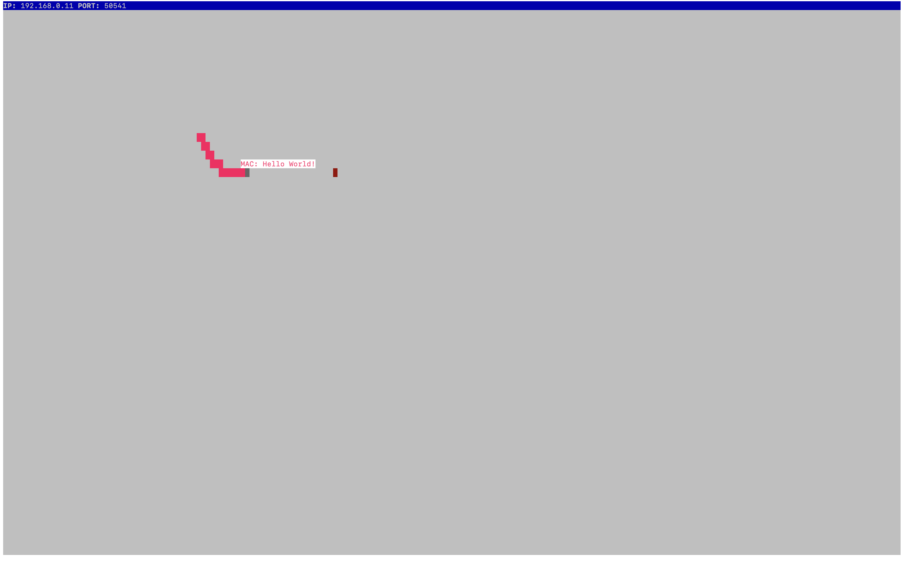
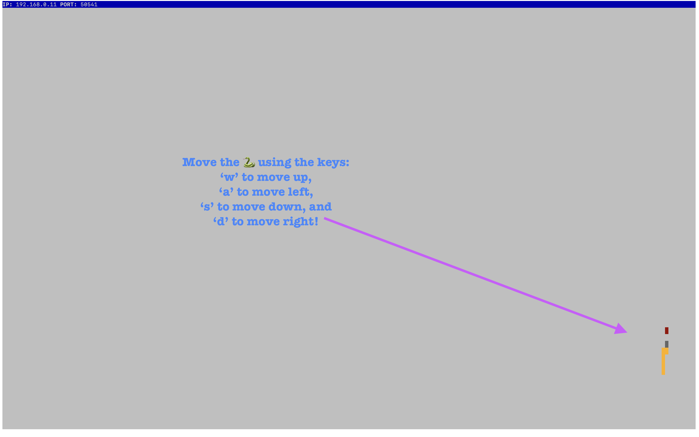

# Snake Client Project

Snake game is based on a very popular video game concept. The player maneuvers a dot and grows it by ‘eating’ pieces of food. As it moves and eats, it grows and the growing snake becomes an obstacle to smooth maneuvers. The goal is to grow it to become as big as possible without bumping into the side walls, or bumping into itself, upon which it dies... Game over! 

This is simply a multiplayer take on the genre.

Before you can run this client, you will need to be running the server side which you can download / install from here: `npm install @uzernamex/snake`

Follow these steps to play: 

**Install it:**

`npm install @uzernamex/snake`

**Require it:**

`const _ = require('@uzernamex/snake');`

## Final Product

[A snake on the move!](#)

[Use the keys provided to play](#)

[Avoid crashing into walls!](#)

## Getting Started

- Follow steps inside the snek server repo to run the server side: `npm run play`

- Run the development snake client using the `node play.js` command.

*Have Fun!*